# Game Design Document (GDD)

  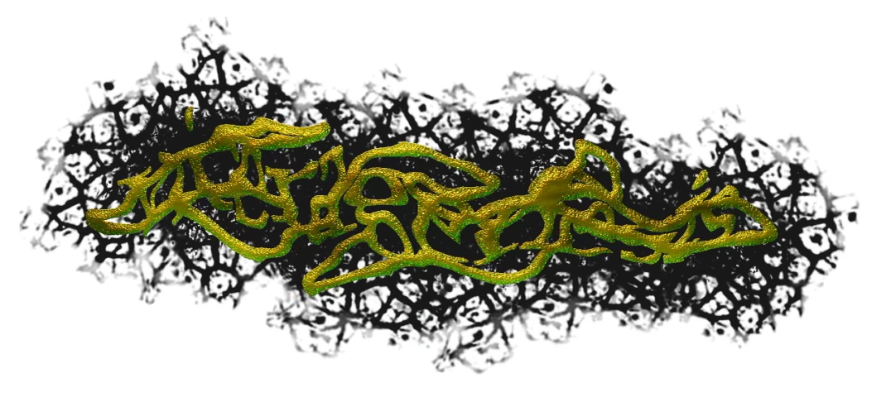

### Table of contents
* [Game Overview](#game-overview)
* [Story and Narrative](#story-and-narrative)
* [Game Progression](#game-progression)
* [Characters](#characters)
* [Gameplay and Mechanics](#gameplay-and-mechanics)
* [Levels and World Design](#levels-and-world-design)
* [Art and Audio](#art-and-audio)
* [User Experience](#user-experience-ux)
* [User Interface (UI)](#user-interface-ui)
* [Technology and Tools](#technology-and-tools)
* [Team Communication and roles](#team-communication-and-roles)
* [The Challenges](#the-challenges)

# Game Overview
* in _Viceragenesis_ you play as a nimble, shifty virus. Destroy the beast you inhabit!

* You must avoid the attacks of various defenses that represent the body fighting back, such as white blood cells.

* ~~The game acts as one open level, the monster body you inhabit, and you need to move to the vital organs, the game's “boss battles” and destroy all of them to achieve your goal.~~
* update 6/10 - The game is now following a more linear structure - moving through isolated levels. The reason for this is primarily due to time. We lack the time to create a intricately designed open level, and the knowledge of unity to optimise such structures. The levels are the stomach, the heart, and a final battle with the brain. We have gone from three levels to two, due to scope.  

* There is foggy lighting that makes it difficult to see deep down blood vessels, obfuscating the render distance, with pulsating fleshy texture making your haunt of the body all the more eerie.

* It falls into the “bullet hell” genre primarily, however lacking the other hallmarks of the “shoot-em-up” genre of which “bullet hells” are normally associated with, as in, you do not shoot back with a stream of bullets of your own, but a simple, weak dive.
* update 6/10 - the gameplay uses a lot of platforming mechanics now too, as we found that during gameplay in a 3d space, avoiding bullets can be quite hard, but precise platformming lends itself well to our considered movement in the game. Its less bullet-hell style now, but still has some amount of bullet hell elements. 

* This means there is a great degree of the classic hypnotic bullet patterns the player must weave through, much like the “bullet hell” segments of _Nier Automata (2017)_,  but lacking the top-down perspective.

  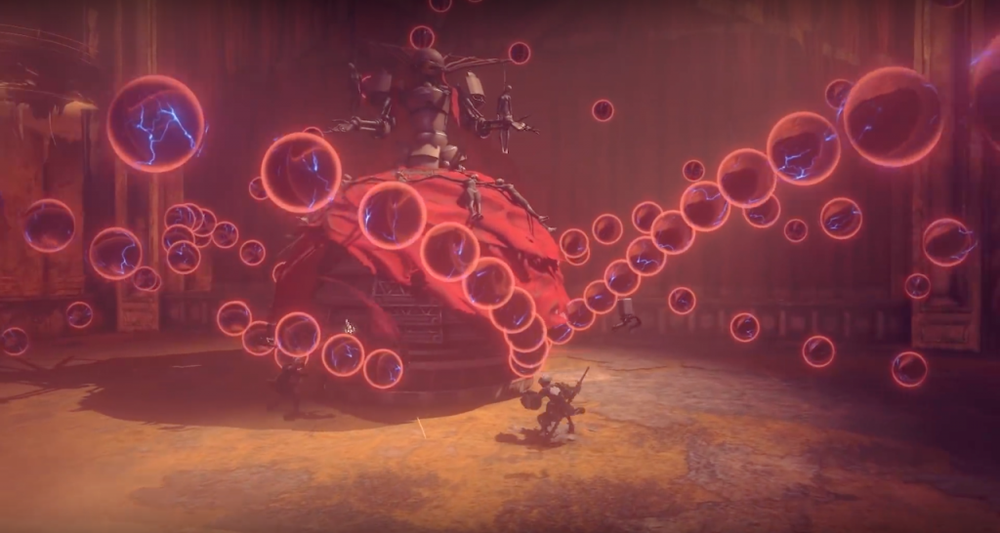

   Nier Automata (PC version) [Video game]. (2017), PlatinumGames

* The principle idea of the bullet hell is to make the virus seem vulnerable, almost skin tinglingly so. Imagine the virus sneakily moving through a body, unseen and unfelt. If the virus were powerful, it would reduce the eeriness of the game by instilling too much control.

* The virus is controlled from a third person view, but what makes it mechanically unique to control is the player lacks a “jump” and can only gain vertical height by tunneling into flesh and jumping out, like a dolphin through water. Addtionally, the player is a sort of worm-like entity, only moving forward with limited side-to-side mobility. This makes moving an important and difficult task to consider when avoiding bullets, and its uniqueness helps immerse players in the gameplay.

* The target audience is late teens and early 20s. The singular theme of being in the body, as well as the low poly graphics, are an excessiveness that can be widely adopted by an experienced young crowd, who may have grown weary of family-oriented, crowd pleasing games, and want something edgier with more focus. This audience will be old enough to appreciate the heritage of the shoot-em-up genre and the graphics which serve as a callback to the era of that genre’s peak.

* Our unique selling point is how we reimagine the setting of the internal body. We are taking advantage of the real, complex pathways in the body, but allowing creative freedom to create compelling level design from the inspiration, all whilst maintaining a dark, foreboding eeriness through bloody textures and foggy lighting. One inspiration for this is _Mario & Luigi: Bowser's Inside Story (2009)_, where Bowser's internal organs are given a great deal of character and colour, whilst still be slightly unsettling.

  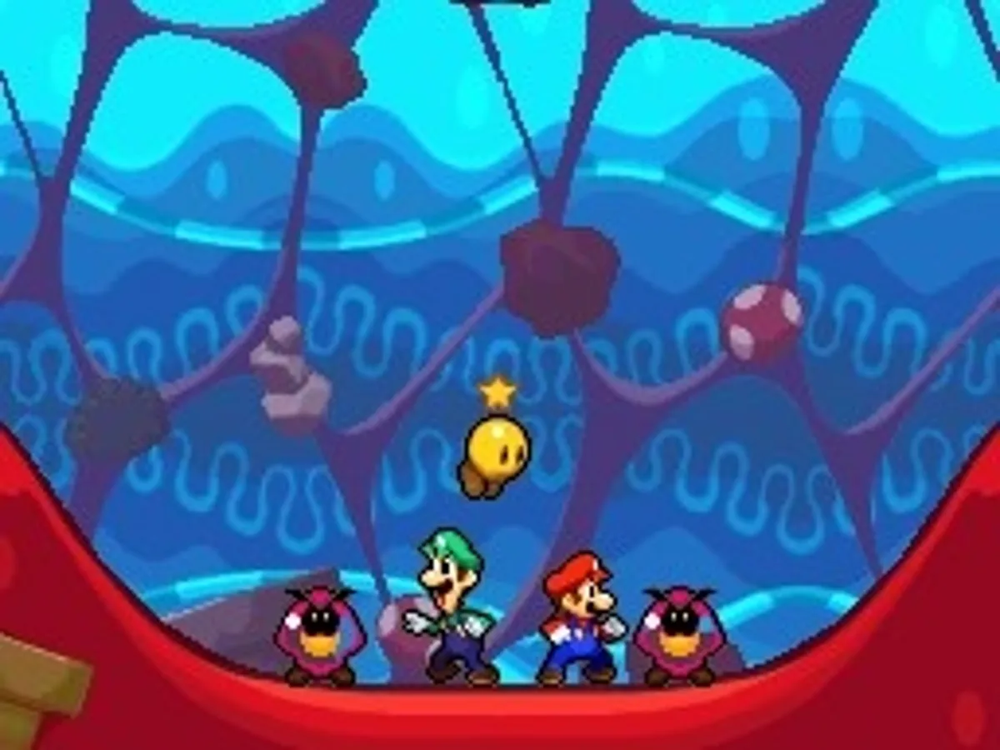
  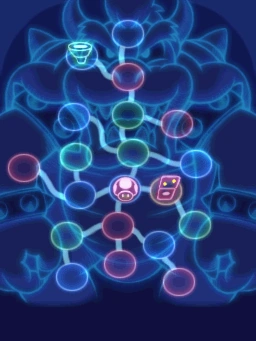

  

  Mario & Luigi: Bowser's Inside Story (DS version) [Video game]. (2009), Nintendo.

  These screenshots showcase Bowser's stomach and the map of his organs. 

* It reimagines and gamifies many biological concepts, allowing the game to flourish into something unique as we seek inspiration from reality rather than what is tried in other games.

* In terms of Scope, we want _Viceragenesis_ to consist of 3 main bosses, alligning with the traditional short length of bullet hell games, as well as keeeping the game in scope for what is possible in the semester. The simple mechanics accomodate this well.

# Story and Narrative

Taking the term “invasive species” to a whole other level, Viceragenesis’ progenitor has infected the world, destroying mankind’s autonomy. Spawning numerous strains, each strain strives to inhabit as many creatures as possible in a world where not very many are left. Viceragenesis, a lone strain occupying a host, has a unique opportunity: legacy. A parasite, it must exploit the host to survive, requiring specific neurotransmitter compounds from a human brain to reproduce. 

Rendered with a low-poly aesthetic reminiscent of early 3D gaming, the game is set within a vast, sarcous monster’s body. _Viceragenesis_ finds itself in a glowing pulsating tunnel that is the bloodstream, among the many other blood vessels that snake through the body. Placing the setting of the game within a body aims to challenge the player’s common knowledge of anatomy with the unsettling reality of being within it.

# Game progression

The body is divided into different regions, each representing a critical part of the gameplay – each organ presents a new challenge:
* ~~Bloodstream~~
  * ~~**Environment**: A network of dark red, glowing pulsating veins and arteries. Dark and foggy, the player must traverse the blood vessels to reach each “checkpoint” (major organ).~~
  * ~~**Objective**: Evade and outmaneuver the white blood cells that are defending the host whilst finding the next major organ.~~
  * this environment was cut due to time constraints.
* **Stomach:**
  * **Environment**: A curved cavern with a pool of acidic, yellowish liquid sitting at the bottom. The stomach walls are lined with digestive enzymes and can contract.
  * **Objective**: Survive the harsh environment. Avoid being crushed by the stomach walls and the digestive enzymes, and navigate around the areas covered by the corrosive stomach acid to the defeat the stomach.
* **Heart**:
  * **Environment**: A segregated, room-like area with empty, echoing chambers and rhythmic valves. 
  * **Objective**: Maneuver the moving chambers and pass through the valves of the heart. Destroy the heart!. 
* **Brain**:
  * **Environment**: An intricate network of neural pathways and blood vessels. The atmosphere is ethereal rather than gross; active regions are more vibrant, with occasional bursts of bright flashes that indicate synaptic activity.
  * **Objective**: The final boss of the game. Destroy the brain!

# Characters
* Viceragenesis (Player): The last of its strain, Viceragenesis aims to infect the host’s brain and reproduce using the monster’s neurotransmitters.

* Stomach Ulcers: Large, irregularly shaped blobs that live in the host's stomach acid.

  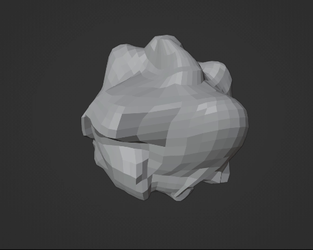

  An untextured stomach ulcer we modelled in Blender.

  

* Macrophage: Large, amoeba-like cells that surround and kill microorganisms, remove dead cells, and stimulate the action of other immune system cells. A special type of white blood cell, macrophages are an elite enemy that aims to swallow the player.
  
* Digestive Enzymes: Amorphous purple blobs resembling closed flowers that open to absorb and break down substances, including foreign organisms. Digestive Enzymes are not as dangerous as the neural defenders or white blood cells, but still need to be avoided.

  

  Our digestive enzyme model created with Blender.

* Neural Defenders: Small, star-shaped cells that support and protect neurons and neurotransmitters in the host’s brain. Neural defenders are the most formidable enemy due to their complex and adaptive nature. They can adjust their patterns, react to instructions, support other enemies and summon reinforcements.
  
* Red blood cells: Smooth, reddish biconcave cells that flow through blood vessels and transport oxygen. Rather than combative enemies, these disks act more as obstacles that the player needs to avoid.

  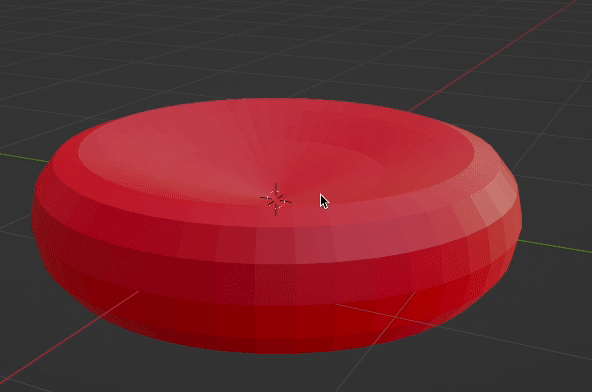 

  Our red blood cell enemy we modelled.

# Gameplay and Mechanics

* **Player Perspective:**: _Viceragenesis_ employs a third-person perspective, positioned slightly above the centipede-like player. This view is crucial because it provides the spatial awareness that the player requires to navigate the body and the depth perception that helps the player gauge distances and plan their paths, whilst also making them seem weak.

* **Controls:** The player controls the parasite using standard keyboard and mouse input, the player can move in all directions to make it easy to avoid bullets, and then change direction with the mouse. ~~They are unable to strafe, as this would interfere with the functioning of the wormlike dynamic animation we seek to add. This also means bullet hells dont become too easy.~~ strafing has been added, as our animation works well with it and we can have more diverse platformming and bullet hell elements. 

* **Progression:** The game progresses through the monster’s body. Instead of transitioning abruptly between discrete levels, the player navigates through a coherent and evolving world. With each major organ the enemies become more formidable and environmental hazards intensify, maintaining the difficulty scaling aspect that level-based games achieve but still contributing to the overarching narrative in a fluid way. The player loses health when it comes into contact with hazardous material like stomach acid, or is hit by enemies - upon death, the player is reset to the last major organ.

* **Gameplay Mechanics:** Our game relies heavily on evasion and strategic movement. Viceragenesis moves like a centipede in 3d space. The parasite can tunnel in and out of tissues to avoid obstacles and enemies. Viceragenesis has minimal combat abilities, and instead relies on evasion to progress through the host. The lack of combat abilities was intentional, and is used to develop an eerie feeling whilst playing the game. Each organ presents a unique environment with its own hazards and features, making the player utilize different evasion and survival strategies, however, the player can still launch out of a dig into a dive, which can hurt an enemy it hits, which will be used in bosses. The player can take at most three hits before being destroyed, with the length of the centipede getting shorter to signify this. There are health pickups to get your health back after challenging sections. The digging and diving makes for satisfying precise platforming too. 

* **Motivations:** The game has a fixed goal: destroy the brain, whilst the increase in difficulty with each organ provides the player a sense of accomplishment. There are three bosses to defeat before beating the game. 

# Levels and World Design

* **Game World** The world is the inside of a body where each organ and blood vessel serves as a unique, interconnected environment. The game world was taken inspiration from real human anatomy incorporated with fictional elements, allowing for creativity and fantasy elements of a horror game.
  * The game world conveys a sense of eeriness using elements of body horror/ gore themes as well as a well designed cold and humid atmosphere inside a body.
  ~~* The entire map is one single level with multiple rooms as organs inside the body traversed through maze-like blood vessel structure. The player is provided with a top down, pixelated minimap to help traverse the word.~~ the minimap was cut as it provides no benefit with the refined gameplay structure to be more linear. as previously noted, the gameplay structure follows a linear structure now. 
  * Each room has a different and unique gimmick, providing the player with a new experience throughout the game. Design wise, since rooms are modeled based on organs, they all have different themes, color palette and textures using real life inspiration.
  * The game world and maps are designed with game progression in mind. After completing one room, the player is granted the opening to the next level. Therefore it would be best to design rooms with increasing difficulty, with the first room acting as a tutorial playground. The final room is a boss room, completing it grants victory and the player finishes the game.
 
* **Objects**
  * **Levels:** rooms are static but organic shaped, each with a different theme. Rooms are filled with traps that harm the player(tentacles, cysts, tumors) or non-hostile elements of the room(fluid, tunnels).
    * Start Menu
    

       
    

    

    A floating sign we modelled for the Start Menu.
    

    * Introduction Levels

    * Stomach
    * Heart
    * Blood Vessel
    * Brain
      
  * **Enemies:** enemies are moving AI agents that target the player, presented as the immune system’s cells or other parasites. Randomization can also be added to enemy movements to add unpredictability. There are also static turret style enemies, and bosses within the main rooms.
* **Physics**: The game implements simple collision based physics, which does not include complex rigid body movements but still have a number of different moving objects carrying colliders:
  * **Dynamic Colliders:** Enemies, the player, and any moving objects (like projectiles) use dynamic colliders. These objects will not be affected by gravity since we do not want strong gravitational force inside the body.
  * **Static Colliders:** Walls, traps and other non-moving environmental objects use static colliders. These objects will only trigger effects if in contact with another object, but will not be able to move.
  * **Omni-Directional Movement**: Enemies and the player move in all directions in 3-Dimensional space, inside confined spaces. While the player moves with WASD keyboard control, the enemies movements are based on various pathfinding algorithms, with unique movement behavior (move in curved paths, bouncing off walls, sprinting,... ).
  * **Collision-Based Damage:**  Enemies/ traps when collide with the player will deducts health points from the player, of which there is only 3, to make the game difficult. 

# Art and Audio
* **Art Style**: To represent the atmosphere of the eerie environment inside a body, we make use of a certain color palette, organic shaped models and gore themed design. We take inspiration from modern horror indie games that try to mimic older PSX games’ graphics in order to furthermore add grittiness and filth to the design of the world. This style fits well with the time limit of the project since it requires less effort than detailed modern graphics style.
  * **Graphics**: Lo-fi, pixelated texture or we can use actual images and pixelate them down since real images look organic. Models are low poly models, simple geometry shapes to mimic old games graphics. Post-processing techniques such as camera pixelation, color quantization and dithering can be used to emulate low quality graphics.
  * **Atmosphere**: Dark and foggy levels to conveys the eeriness and humid environment inside organs. Post-processing techniques such as filter grains, vignette can be used to enhance the horror visual theme.
  * **Art**: Body horror theme with a lot of blood and flesh with inspirations from real medical imagery. Make use of many organic shapes for living objects. Primary color used is dark red for the map and bright colors for enemies and players, occasionally there can be glowing elements in the dark to alert incoming dangers.

| 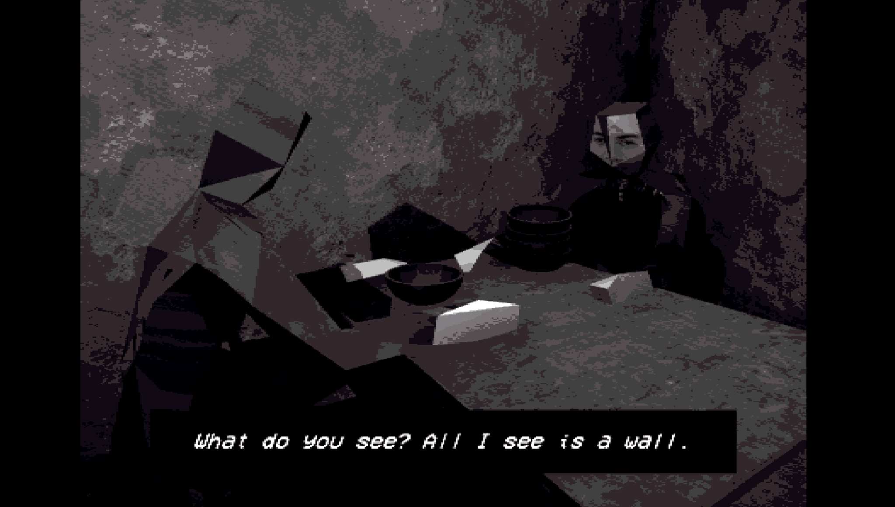 Concrete Tremor (PC version) [Video game]. (2023). Mike Klubnika | 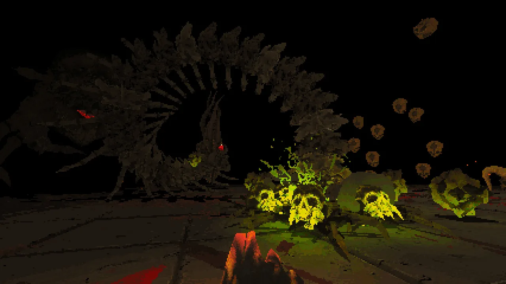 Devil Daggers (PC version) [Video game]. (2016). Sorath. | 
|---------------------------------------------------------------|-----------------------------------------------------------|
| 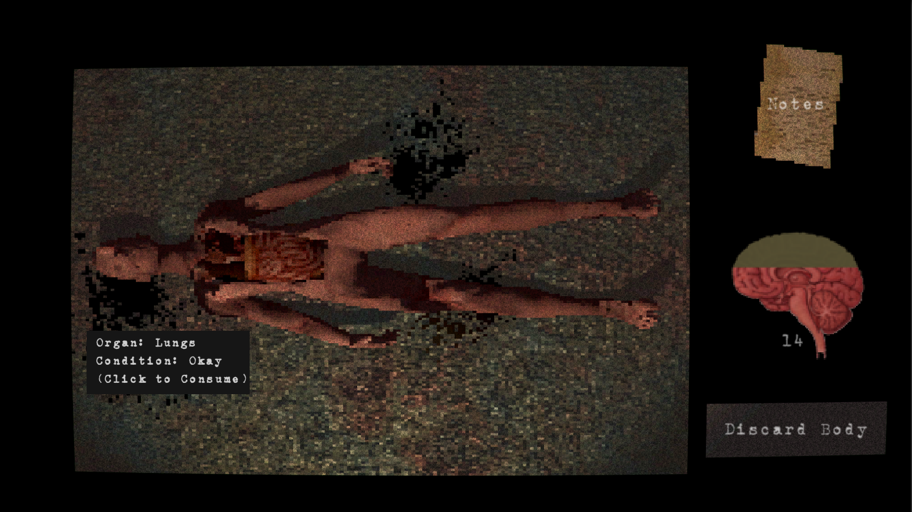 Carcass (PC version) [Video game]. (2024). ToothandClaw.          | 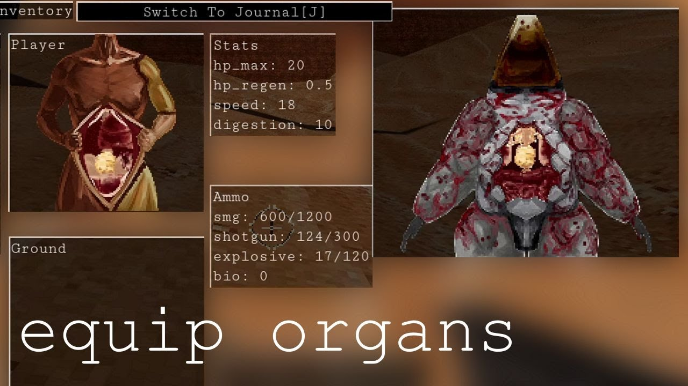 Deep Root Interactive. (2021). Wrought Flesh (PC Version) [Video Game]. Narayana Walter.|

* **Sound and Music**: Using clever sound design, we can create a sense of impending dread, significantly amplifying the gameplay experience:
  * **Atmosphere**: Design sound to convey the empty, eerie and isolated atmosphere inside the body of an organism using light ambient noise with pacing and rhythm as a background sound. Small environmental noise (crackling noise, droplet sounds, fluid flowing) can be added to depict the sound of organs working.\
  * **Object noise**: Character sound includes movement noise, sound made when getting damaged. Enemies sound include grunts, movement and attack sound. Traps can also have sound effects such as slamming, thrusting. All these noises need to be pulpy and crunchy to instill eeriness and connect to the setting.
  * **Music**: Can have some smooth ambient music to create contrasting eeriness. Optionally no play music to furthermore add creepiness and help the player focus more on environmental sound.
* **Assets**: We utilize readily available free 3D models and textures on the internet since our budget is limited. Since we are aiming for PSX style graphics, finding low quality assets should not be difficult, furthermore we can downgrade high definition assets to fit our art direction using the following techniques:
    *  Add filters and pixelations to existing textures to add grittiness. Example:
    *  | 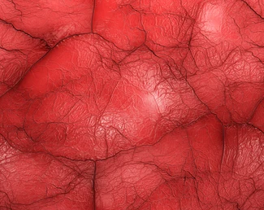 Unedited Flesh texture | 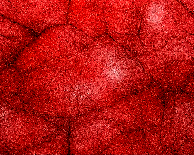 Edited Flesh texture with color correction and noise filter | 
       |-------------------------------------------------------------------------------------|-----------------------------------------------------------------------------------------------------------------------------|
    *  Simplify mesh of existing 3D models using geometry decimation:
    *  | 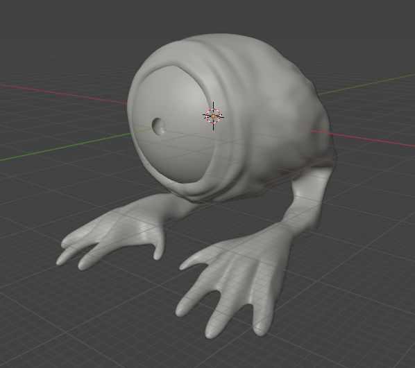 Example unedited high-poly monster model | 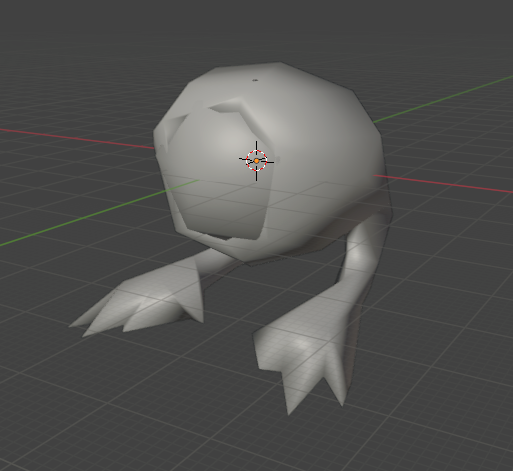 Low-poly model achieved by decimating the geometry multiple times | 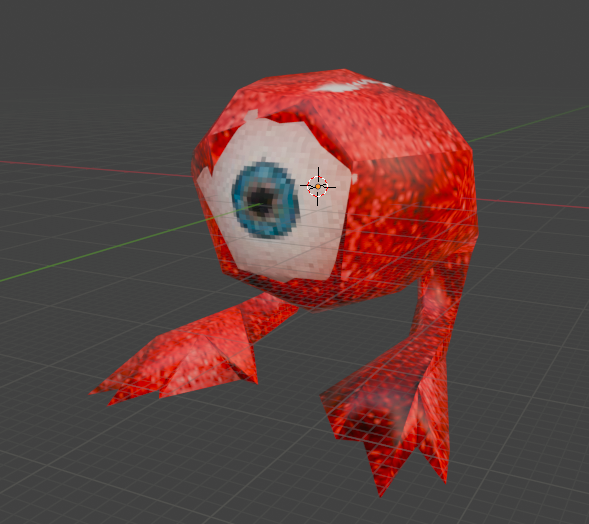 Low-poly model with pixelated texture on | 
       |-------------------------------------------------------------------------------------|-----------------------------------------------------------------------------------------------------------------------------|-----------------------------------------------------------------------------------------------------------------------------|
    *  Use available PSX style assets:

  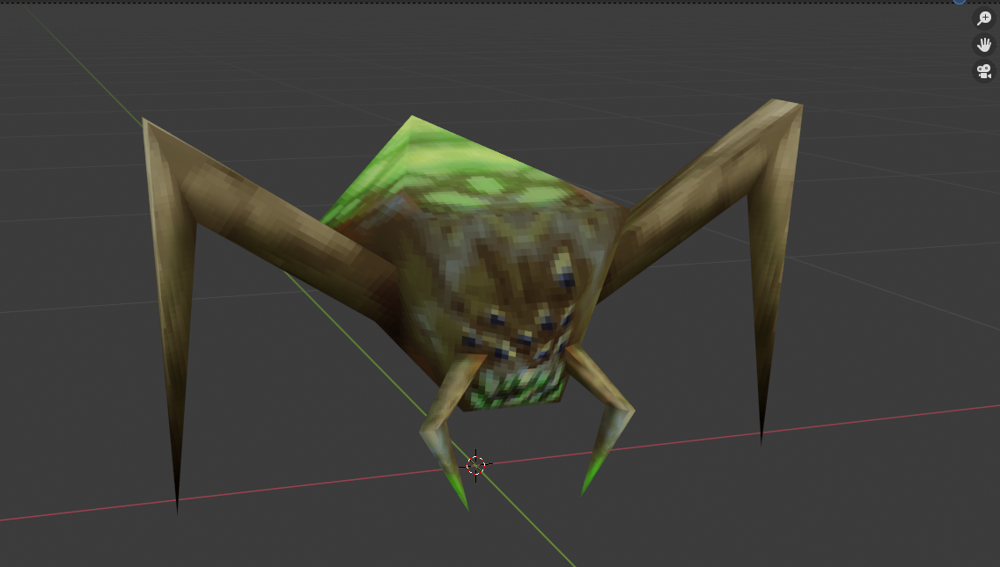

   “Scab” monster model by MaxDamange taken from https://maximumdamage.itch.io/scab

# User Experience (UX)
* Not easy to interpret UI elements and add obscurity to UI values; makes the player unaware of the current situation in game and adds to the abstract scenario and visuals, like an eerie dream.
* The UI is intentionally difficult to interpret. You are thrust into this intensely abstract, maximalist world. The experience should reinforce that. It's intense.
# User Interface (UI) 
* Minimal number of functional UI elements only displaying the most important values.
* Use realistic horror-themed images for UI elements instead of abstract shapes or numbers.
* non-functional decorative elements on HUD for artistic purposes.
* Displaying text dialogue as a banner.
* UI inspiration:

  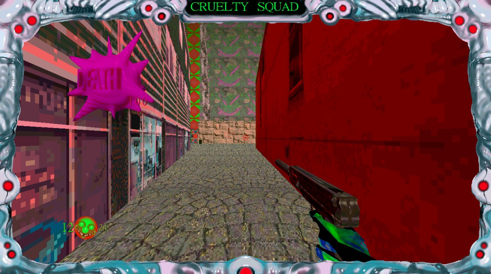

   Cruelty Squad (PC) [Video game]. (2021), Consumer Softproducts.

# Technology and Tools
* **Code**
  * Unity for game engine
  * C# for programming language
  * Git for version control
* **3D Modelling**
  * Blender for 3D modeling
* **Image editing**
  * Adobe photoshop for image manipulation
  * MS Paint for creating simple textures
* **Sound design**
  * Reaper for sound design
* **Communication**
  * Trello for task management
  * Discord for online text and calls
* **Documentation**
  * Google Docs for drafting
  
# Team Communication and roles
* Currently, we are working off a Trello board that is continuously evolving over time. We have made agreements about when we want each task to be completed, to ensure streamlined development.

* The team agrees to communicate in a manner which is constructive, acknowledging that people have different standards of work and different timelines. We want all of each other's ideas to be heard.

* In terms of standards of team work, the team has agreed to never directly merge to main without a pull request, work in feature branches, and make explicit what they are working on.

* The team will meet weekly on Tuesday, where we will have a pseudo stand-up, communicating where we are at in relation to deadlines, updating the Trello, and our plans for the week ahead, including potential blockers. 

The roles of the team and their respective tasks are as follows so far:

| Team Member | Role                           | Tasks                                                                                         |
|-------------|--------------------------------|-----------------------------------------------------------------------------------------------|
| Ethan       | Team leader & Programmer       | Team management, player code, GDD markdown, equal contributor to writing                     |
| Ella        | Artist & Sound designer        | Half-responsible for asset gathering and asset creation (if required), level design, audio design, equal contributor to writing |
| Alex        | Programmer & Designer          | Programming, game and level design, graphics programming (½), equal contributor to writing     |
| Khue        | Programmer & Artist & Designer | Programming, Art asset collection, graphics programming, boss design, equal contributor to writing  graphics programming (½)|

* **Resolving merge conflicts** - The creator of the pull request and the person allocated to merging (Ethan) Will work together to resolve merge conflicts and commit any resulting hotfixes to a new branch once the merge has complete. With working in Unity, merge conflicts will be a recurrent challenge, as we all may need to modify common files, such as layers and tags. 

# The Challenges
* Certain challenges may arise in development that we need to be aware of and accept. One immediate one is that we are new to building 3d games with unity. 

* Whilst we have a good deal of programming experience, Unity programming demands a different approach to standard Java object oriented programming we have learnt so far. Additionally, we have not done graphics programming before, or worked with concepts like animation. As such, we need to account for the central problem in games development for beginners: scope creep.

* In order to account for this, we need to be as realistic about deadlines as possible, and accept the reality that we may have to scale back our game development as required. 

* Since we are especially lacking in artistic experience, specifically in 3d art, it is understood that we may have to rely on internet assets. Where possible, we want this to fit our desired art style, but will compromise as seen fit, empathizing that we lack the time as final year university students to learn and create appropriate 3d art. 
