# Project 2 Report

## Table of Contents

- [Evaluation Plan](#evaluation-plan)
- [Evaluation Report](#evaluation-report)
- [Shaders and Special Effects](#shaders-and-special-effects)
- [Summary of Contributions](#summary-of-contributions)
- [References and External Resources](#references-and-external-resources)

# Evaluation Plan

## Evaluation Techniques
### 1. Observation Hybrid: Cooperative Evaluation - Post-Task Walkthrough

We have decided to utilize a hybrid of two observational techniques taught in class to leverage each technique's benefits. To avoid overlooking insights due to overwhelming tasks, observations will be limited to "levels" and short experiences at a time. 

For each individual, we will ask them to comment on any aspects of the game that they like or don't like during the walkthrough, rather than asking them to walk us through how they play the game. This attempts to reduce the "think aloud" awkwardness that can occur when one has to dictate their actions, simultaneously trying to avoid the awkward silences that can occur with the "cooperative evaluation" technique. Additionally, by opening the conversation up during gameplay, we can record insights and details that occur in real time without risking them being forgotten, which can occur with the "post-task walkthrough" technique. 

We aim to reduce the overhead the user faces while playing the game by recording the general "what", "why", "what next?" thought process from our own observations rather than dictation directly from the user, and limiting our questioning of those observations to points of confusion or anomalies. By asking the user to comment on emotions they feel and their likes and dislikes during the gameplay, we can record those comments and then utilize an informed "post-walkthrough" approach. Prior to the evaluation, we will have a prepared set of questions that can be adapted to user's comments to gain greater insights. A few adaptable questions for example:

* You mentioned [ aspect of game ] was [ visual description ]. What specifically made it [ unappealing or appealing]?
* What emotions did you feel during the gameplay? 
* Why was [ experience in game ] frustrating?
* What influenced that decision for you?
* At any point did your mind wander? [when, (if so) were you bored?]

Though there is the risk of experimenter bias influencing observations, we believe the trade-off with the insights we can obtain from our observation strategy has greater benefit.

### 2. Query Techniques
#### 2.1 Interviews
As mentioned above, we plan to conduct post-walkthrough interviews. By interviewing the users with adaptable questions, we hope to create an interview that is semi-structured. The structured aspect of the interview will help us ensure we ask crucial questions, and the adaptable aspect of the interview allows us to deviate for insight. 

[Here](./readme-eval-docs/PostWalkthroughQuestions.pdf) is an example semi-structured interview.

#### 2.2 Scalar Questionnaire
To end the evaluation, we plan to ask the user to fill out a quick anonymous usability questionnaire, based on post-study questionnaires for User Interaction Satisfaction (Brooke 1996). This aims to uncover any usability or frustrations that the user may have encountered but either felt too awkward to express (hence the anonymity), or too abstract to articulate in an interview format. Additionally, the scalar nature of the questionnaire will provide us an easy metric for analysis of our game, a good foundation for evaluating the user experience.  

[Here](./readme-eval-docs/Viceragenesis%20Game%20Experience%20Questionnaire.pdf) is our planned usability questionnaire.

## Participants
Our target audience are late teens and early 20s that appreciate edgy themes, low poly aesthetics, and the bullet hell subgenre. 
The reason for this particular target audience is that these kind of aesthetics have recently re-emerged in many independent games online that the age bracket we have selected is more likely to be familiar with. It harkens back to the Nintendo 64 and Playstation 1 era of modelling and texturing, which have often been marked as unsettling thanks to pioneer horror games like _Resident Evil_ and _Silent Hill_, which perhaps our audience is too young to be nostalgic for, but capable of recognising the eeriness instilled by these uncanny-valley worlds. This age is likely to be more cognizant of the breadth of game aesthetics, which will allow them to appreciate the surreal bizarre nature of ours, which may be lost on older generations or younger generations which associate games with a degree of realism and belivability. The bullet hell subgenre of our game also demands reflexes of those experienced with games, and those switched-on enough to have high reaction times in general. People too young or too old may not fit this criteria. 

### Recruiting Participants
Due to time constraints, most of our participants will be friends and fellow students that fit in the age demographic of our target audience. Our reasoning behind this is friends are likely to be willing to dedicate time and effort to our experiments, ensuring we have engaged participants that are comfortable sharing their thoughts. We also believe that people that we know will be able to interpret and appreciate the central goals of our aesthetic, and be able to more easily interpret the game without excessive explanation, which should allign with our target audience neatly. 

Additionally, to provide greater insight regarding the clarity of our levels and tutorials, we will recruit people close to us, but not necessarily alligned with the "gamer" crowd we wish to be our target audience. For example parents and family, simply to understand how certain elements of the levels might not be clear to a general crowd, which will provide insights in relation to our target audience too. Even if they cannot play the game well, their observations may prove valuable

We recognize that the reliance on friends may introduce bias to our evaluation, however, the milestones timeline in this subject limits our options, so we believe this is the most effective recruitment strategy.

While we will aim to recruit friends that are experienced with games and have a good chance of appreciating our game's genre and aesthetics, we do not want to ignore the edge cases (still within our target audience) that could provide insight. These include inexperienced users, "uninterested" users, and users that do not have a personal relationship with any of our team. By "uninterested" users, we refer to users with either little interest in gaming or typically would not gravitate to this type of game genre. We plan on recruiting these users through classes, tutorials, and external activities, such as sports, workplaces, etc.

To summarize, we plan on recruiting the following:

| User Demographic  | Number of Users |
| ------------- |:-------------:|
| Experienced, interested | 8    |
| Inexperienced or "uninterested" | 3 |
| "Random"      | 3  |

Note: demographic categories may overlap. We will have at minimum 10 users.

### Qualifying Criteria
A benefit of recruiting friends is the knowledge of the user's interests prior to the interview, informing our selection of users primarily appreciative towards our game's genre and aesthetics. For those we are unfamiliar with, we plan to ask 3-5 basic screening questions that will inform us which category the user potentially fits in (random, inexperienced, uninterested, appreciative):

* Do you play video games? [ never, rarely, 1-2 times per week, etc. answer ]
* What are your favourite games? 
* What are your preferred game aesthetics?
* What are your favourite game genres?

**Important to note we will first seek consent from potential participants before asking questions and explain the anonymity of their identity and data, as well as clarify the purpose of the screening questions.**

## Data Collection
Our Data collection processes and type of data collected depends on our evaluation techniques. The below table shows our data collection process for each technique:

| Evaluation Technique  | Data Collected | Data Collection Process |
| ------------- |:-------------:|:-------------:|
| Screening Questionnaire | User age and occupation, game habits, game interests | In-person interview or online form* |
| Post-Walkthrough Interview | Emotions experienced, opinions on aesthetics, mechanics, and story, gameplay experience  | In-person/Zoom interview, face to face** |
| Scalar Usability Questionnaire | User scalar answers to questionnaire  | Online or paper form |
| Observations during Gameplay   | User body language, initial comments, opinions on game, decisions, confusion, emotions  | In-person or Zoom observation (shared screen)** |

*Dependent on consent given, either recorded audio, written notes, or both.

**Dependent on consent given, either recorded audio, recorded video, written notes, or a combination of the three.

We will provide a consent form to each user, outlining the different recording options and how the data from our experiments will be collected and used. Each user can withdraw at any time.

### Tools Used for Data Collection
While in-person gameplay observations and post-walkthrough interviews are preferred, we will utilize Zoom to conduct online interviews, as the share screen and recording features allow us to faciliate interviews in the case where in-person interviews are not an option.

We will use [Survey Monkey]([https://snapforms.com.au/survey-monkey-alternative/](https://www.surveymonkey.com/welcome/sem/?program=7013A000000ih75QAA&utm_bu=SVMK&utm_campaign=71700000058894454&utm_adgroup=58700005408390471&utm_content=43700079965418603&utm_medium=cpc&utm_source=adwords&utm_term=p79965418603&utm_kxconfid=s4bvpi0ju&gad_source=1&gclid=EAIaIQobChMIyLCP4pT2iAMVsqVmAh19FzQVEAAYASAAEgKlNvD_BwE&gclsrc=aw.ds)) software for our questionnaires, as they have student plans.

Previous questionnaires have informed our current forms, including the basic usability questions from [SUS](https://doi.org/10.1201/9781498710411-35) and [Post-Study System Usability Questionnaire](https://trymata.com/learn/pssuq/#:~:text=The%20current%20iteration%20of%20the,end%20of%20a%20usability%20test.) (PSSUQ), and the desirability questions from the [Adoption Likelihood Factors Questionnaire](https://trymata.com/learn/alfq/) (ALFQ).

## Data Analysis
For the questionnaire, there will be two sections: usability and desirability. The questionnaire will mainly be comprised of usability questions, and using a scale for answers (rated on a scale 1-7), we will take the average score across users. Standard deviation calculations could also be informative, determining the variability in responses that have a wide range on the scale. The desirability section of the questionnaire aims to investigate user engagement.

For each observation and post-walkthrough interview, we will condense our qualitative findings into insights, and discuss the insights. Identified patterns, themes or common feedback can then be condensed into categories, and these categories will be discussed as a team to determine which are actionable.  

Comparing interview insights to the questionnaire results allows us to compare two forms of data, creating opportunity for our team to pinpoint discrepancies in our data collection processes. For example, positive qualitative feedback but negative usability scale scores would indicate that the game conceptually and aesthetically is engaging, but the gameplay may be frustrating.

After the evaluations are completed, insights are condensed and questionnaire scores are calculated, we will have a discussion as a team to decide which changes will be made. Priority will be given to the insights with the highest discrepancies, and the results with the most agreeability from users (e.g. all users rated [ feature a ] low on the usability scale).

## Timeline

| Week 10  | Recruitment and Preparation Stage  |
| ------------- |:-------------:|
| Sept 30 - Oct 1   | Finalizing evaluation plan   |
| Sept 29 - Oct 2 | Prepare materials (questionnaire and adaptable questions, surveys, consent forms) |
| By Oct 8 | Confirm participant availability, schedule evaluation meetings  |
| Prior to evaluation meetings | Send consent forms to participants |

| Week 11  | Observation and Interview Stage  |
| ------------- |:-------------:|
| Oct 7 - Oct 13   | Conduct evaluations, updating results after each evaluation takes place   |
| Oct 7 - Oct 13 | Condense insights and evaluation results, contributing to main insight document regularly |
| Oct 13 - 14 | Discuss evaluation results from interviews |

| Week 12 | Updating Stage|
| ------------- |:-------------:|
| Oct 14 | Submit gameplay video that incorporates early evaluation insights  |
| By Oct 15 | Discuss and identify changes to game, assign tasks |
| Oct 15 - 18 | Review all gathered data, add evaluation results to final report, and update GDD accordingly |
| Oct 15 - 26 | Add changes, "before and after" visuals to final report along with explanations

| SWOTVAC | Finalization Stage|
| ------------- |:-------------:|
| Oct 22 - 26 | Finalize game updates, continue to build final report  |
| Oct 26 - 29 | Testing of the game, regularly testing how the game builds, reviewing project report |
| Oct 29 - 31 | Submit final report and game |

## Responsibility
We have tried to play to each group member's strengths in splitting up the work. Member task responsibilities are as follows:

* __Level asset collection__: Ella and Hoang
* __Enemy implementations and refinements__: Alex
* __Intro Sequence and end screens__: Ella
* __Level 1 implementation__: Ethan
* __Level 2 implementation__: Ethan and Alex
* __Particle system development__: Hoang
* __Shaders__: Hoang
* __Player movement and mechanics__: Ethan
* __Evaluation Plan, updating the GDD and majority of Final Report__: Ella

Our team leader Ethan created a trello board that provides us with a visual representation of tasks, ensuring that each member has an equal amount of work assigned. Our team has regular check ins, and we each communicate our individual progress throughout the week. 

## Objectives
Our team has a few key questions we hope to answer with feedback from evaluations:

1. Text duration for introduction and practice slides (too short? too long?)
2. Text clarity for health bar, instructions, time limits (easy to read? positioning? font?)
3. Difficulty of level 
4. Engagement throughout the gameplay
5. Emotions experienced during gameplay
6. Clarity of objectives of level (is it easy enough to know where to go? what to do?)
7. Clarity of game mechanics (i.e. how to dash, tunnel, dig to avoid enemies etc.)
8. Adherence to theme (do they find it eerie?)

# Evaluation Report
In total, we interviewed 10 individuals, and the resulting demographic was as follows:
| User Demographic  | Number of Users |
| ------------- |:-------------:|
| Experienced, interested | 6    |
| Inexperienced or "uninterested" | 3 |
| "Random"      | 2  |

The experienced and interested players, as well as the inexperienced or "uninterested" players were recruited through friends and family connections, whilst the "random" players were found at a SWOTVAC study hall. The "random" demographic provided us with insight about our game without the bias of a family or friend connection. 

The interviews and questionnaire provided important data, influencing changes and informing our development team of issues within the game. 

## Key Findings
### Positive Feedback
As expected, positive feedback was less vocalized in interviews compared to critiques, however, our hybrid evaluation system, specifically our questionnaire, helped us identify the positive aspects of the game. Overall, our game was well-received stylistically and engagement-wise:

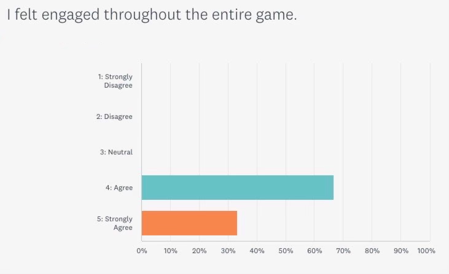
Figure 1: Questionnaire Result for Engagement Level

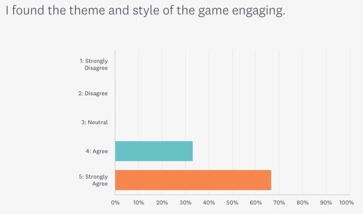
Figure 2: Questionnaire Result for Style and Theme  

Individual comments during the gameplay were mainly about the following:
* Sounds: three individuals commented on the digging sound: "it is so gross!", and four on the crawling sound. It was apparent that this contributed positively to the gameplay experience.
* Acid Shader: five individuals mentioned the acid shader by Hoang, stating that it made the gameplay more immersive and interesting.
* Platforms: the ability to dig up platforms was an interesting game mechanic, mentioned by 7 out of 10 individuals during gameplay.
* Respawn Loading Button: in all of the gameplay evaluations the respawn button was used often and easily, and two individuals made slight, indirect comments towards its use: "Imagine if this button was not here".
* Centipede Rig: four individuals commented that the centipede rig was cool, and that the movement added to the experience: "[the centipede's] movement is so cool, I love how the tail moves".

We also determined that the game was engaging based on our qualitative observations. Many individuals did not want to finish the evaluation and wanted to continue to play and eventually beat the boss, and a few were raised their voices and were clearly emotionally engaged throughout the game play. This gave us key indications that the theme and visuals in our game were engaging, and enhanced the gameplay experience. 

### Constructive Feedback
The constructive feedback mainly related to the difficulty and the introduction of the game. All of the individuals we interviewed felt that the arenas in level 1 and 3 were too difficult, and that some of the game geometry was frustrating (the initial jumping from platform to platform, attacking was too difficult, and the brain boss laser sequences along with the shield was too hard to beat). Majority of the individuals rated the understanding of the game low:

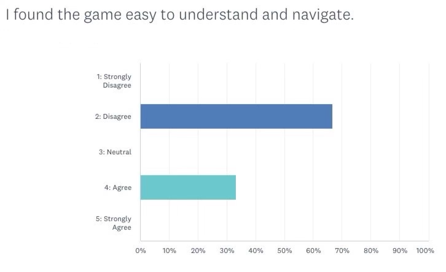

Figure 3: Questionnaire Result for Understanding of Viceragenesis

After post-walkthrough questioning, we were able to pinpoint the main issues related to the critque:
1. It is not intuitive to players, until after many tries to release the dig (the spacebar) while pushing the W key. Some individuals actually never attempted this technique, until our team member conducting the evaluation hinted that it was a useful technique when needing to attack and jump.
2. The green health pickup was interpreted by some as an enemy, and in turn, individuals would avoid the health pickup, making it harder for them to pass checkpoints and win the game.
3. The platform featured in introduction practice scene (IntroPracticeScene) disappears too quickly. This is a cascading effect, as if the player misses the platform tutorial, they are not informed that they can dig up platforms.

Our evaluation also alerted us to small edge cases:
* There were a few instances in the level one stomach where if the individual made a jump and missed the platform, landing in the acid, the player rig would get stuck within the lower plane, and would not be able to resurface. This forced the player to respawn, without the grace of one damage point.
* The player could get stuck underneath the tongue, or be trapped between the monster's skull and the throat quad in the Intro Practice scene (the tutorial scene of our game).
* A stomach ucler enemy in Level 1, in certain gameplays, would disappear prematurely. 
  
## Changes Post-Evaluation
Below are the list of changes made post-evaluation, along with their justifications, i.e. how they address evaluation insights.

### Mandatory Tutorial Tasks
#### Mandatory Platform Dig
From interview results, players do not recognize they can dig up platforms without explicit instructions. By mandating a platform dig, it ensures the player is prepared enough for the game so the counterproductive frustrations experienced during evaluations does not occur. This addresses some of the Level 1 difficulties experienced by individuals during evaluation gameplay. 

Figure 4: Mandatory Platform Dig in Tutorial Scene (IntroPractice)

#### Mandatory Attack and Health Pickup 
Additionally, it was apparent from observing gameplay that the health pickups were not intuitive to players. By mandating a health pickup task in the tutorial, it informs the player and consequently addresses the difficulty frustrations expressed in our interviews. An attack was also added to the tutorial, to allow the player to fully understand the game mechanics involved in a dash/attack.

By introducing mandatory tasks, we believe the initial frustrations of getting the hang of the game are minimized, without removing any productive frustrations (the game should not be too easy).

Figure 5: Mandatory Enemy Attack in Tutorial Scene (IntroPractice)

Figure 6: Mandatory Health Pickup in Tutorial Scene (IntroPractice)

### More Descriptive Tutorial Titles
A counterproductive difficulty we were able to observe during gameplays was the initial jumping from platform to platform in the Level 1 scene. Several individuals took, on average, 5-6 tries to land the jumps, having to respawn repeatedly. From interviews and the questionnaire results, we were able to obtain the insight that this negatively impacted their gameplay experience, as individuals need to experience intial accomplishments relatively quickly after beginning the game, or else their attention is diverted by frustration. We addressed this through adding a title that encourages players to release the space bar whilst holding W, essentially performing a jump or a dash. 

This new title was tested on two of the original individuals performing the evaluation, and they stated that they found this change helpful: "When I first played the game, it took me a really long time to figure out the mechanic of jumping. I think if you add this instruction in, you know how to do it, and then it doesn't take as long to try to play the game."

We also added an arrow, to ensure the cooldown bar for digging was clear.

Figure 7: Cooldown Bar Arrow Addition 

### Introduction Story Slide Duration / Skip Button Additions
In a few interviews, and during gameplay, individuals commented on the duration of the IntroStoryScene's slides. Two individuals commented that they transitioned too quickly, and that they could not read the titles in time, whilst two individuals commented that the slides were too slow. To compromise, and provide options for different paces of reading, we increased the duration of the introduction titles, and added a skip button. The skip button caters to the fast readers, allowing them to skip to the tutorial section, and it also provides a shortcut for players who have already played the game. In the tutorial scene, we followed suit, adding a skip button for those who wish to skip the tutorial.

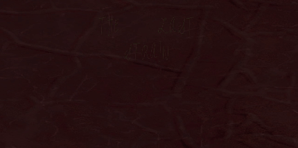
Figure 8: Slide Duration and Skip Button

### Brain Boss Health
To mitigate the "unfair" difficulty experienced in the final boss arena (the brain), we have decided to lower the brain's health. In doing so, we don't eliminate the challenge of dodging the lasers and lightning, or the timing strategy with the shield, but we effectively rebalance the final challenge.

Figure 9: Reduced Health of Final Boss

### Level 1 Arena
Much like the brain boss health reduction, we reduced the frequency of bullets in Level 1's arena. Nearly all of the individuals in the evaluations (7/10) stated that the level 1 arena was too difficult, and one of our team members had to surpass the gameplay and skip to the brain boss to continue the evaluation, as two individuals could not pass the level. By reducing the frequency of bullets, we also rebalance the difficulty to ensure individuals can still be challenged but have fun playing Viceragenesis.

Figure 9: Decreased Frequency of Bullets in Level 1 Arena

### Addressing Small Bugs
Additionally, we addressed the small bugs we discovered through observing gameplay: geometry in Level 1, premature death of a stomach ulcer in Level 1, and a "no-mans-land" in the tutorial practice scene.

# Shaders and Special Effects

### Shader 1: Acid Shader
**Filepath**: 'Assets/shaders/Acid shader.shader'

This shader resemble a glowing green liquid surface and is used extensively throughout the stomach level as stomach acid pools. 
  
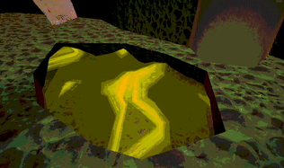
Figure 10: An acid pool in the stomach level

The shader can be broken down into three parts:
  
- **Vertex Displacement**: Displaces the verticies perpendiculally to the normal according to a height map input. The displacement height is then offseted by a sine wave as a function of time, so that the verticies move up and down smoothly and perpetualy. Usually, a Perlin noise or wavy texture is set as the height map to create a liquid-like ripple effect.
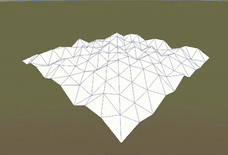
Figure 11: Perlin noise vertex displacement
  
- **Opacity by Height**: Transparency is set according to the height to make the model looks more like a body of flowing liquid.
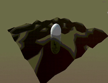
Figure 12: Opacity according to vertex height
  
- **Color by Overlay Texture**: The model is the applied with a moving texture with color. HDR color value is used to add some glowing effect inside a post-processed environment with bloom. This creates a cartoonish and glossy look that fits the theme of our game.
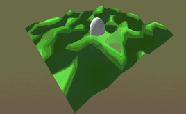
Figure 13: Moving overlay noise texture with color green
  
**Parameters**: 
- Displacement Texture: Acts as a Height Map to displace the verticies.
- Displacement Strength: How high will the verticies be offsetted.
- Tiling: the number of times the displacement texture is tiled.
- Overlay Texture: A moving texture applied on top of the model.
- Color: Set HDR color value to the overlay texture. 

### Shader 2: Voronoi Shader
**Filepath**: 'Assets/shaders/Voronoi shader.shader'

This is a multi-purpose shader that implements the Voronoi noise algorithm (also called Worley noise, celllular noise). The shader applies a moving texture on the model that can be tweaked to resemble many different things such as moving cells, bacteria, eyes,...

The shader is a multisteps, complex manipulations of Steven Worley's algorithm of computationally generating a noise texture similar to a Voronoi Diagram.
  
- **Base Algorithm**: Worley noise is a noise function introduced by Steven Worley in 1996. The algorithm works by randomly placing points in space an n-dimensional space, in this case we are placing points on a 2D plane. The brightness of each pixel on the plane is set to the distance to the nearest point, the closer the pixel is to the point the darker.
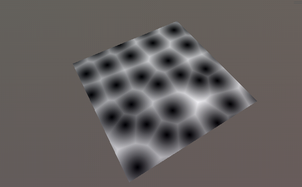
Figure 14: Simple Worley noise texture on a 2D plane
  
To reduce computational cost, points are only generated on a grid, and each pixel only checks for neighboring grid square for nearest point. However, in this shader we are checking for up to the 2nd neighboring grid square, the reason will be explained in the next section.
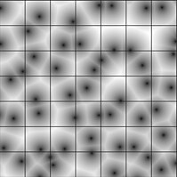
Figure 15: Grid system to randomize point position with one point per square
  
- **Brownian Motion**: Each point is then moved around using a complex wave function that produce unpredictable movements. The wave function is just a combination of trigonometric functions with the amplitude and frequency changing over time. The result is each cells inside the noise texture moving in a brownian-like motion, creating an organic and alive look. 
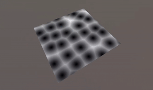
Figure 16: Worley noise with cells moving in Brownian motion
  
Due to points moving around, sometimes they do not stay inside the same grid square they were first instantiated in, therefore pixels need to look for nearest points in a larger area as mentioned in the previous section.
  
- **Smooth Step Border**: Previously, the calcuations to find the nearest point uses the normal min function, as in the minimum between 2 numbers is the smaller one. However, we have experimented with other smooth-minimum functions which allowed better control. Here we are using the exponential smooth function using a tolerance varible k (Quilez 2013) to control the smoothness of the minimum function.
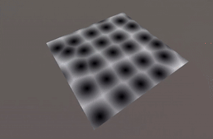
Figure 17: Worley noise using exponential smooth-minimum with varying tolerance
  
Furthermore, if the take the difference between the smoothed Voronoi noise texture and the non-smoothed using simple subtraction, we get a Voronoi texture with a more prominent border.  
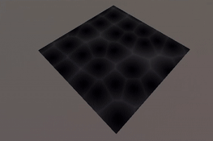
Figure 18: Texture obtain from subtracting the smoothed Worley noise with the non-smooted noise
  
- **Different Distance Functions**: We can achieve even more variations by using different distance calculation metrics:
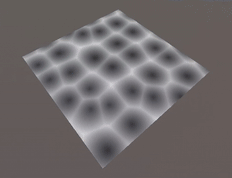
Figure 19: Worley noise calculated using Euclidian distance
  
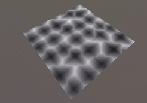
Figure 20: Worley noise calculated using Manhattan distance
  
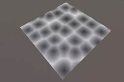
Figure 21: Worley noise calculated using Minkowski distance of 3rd order
  
- **Color and Texturing:** By limitting and clamping bright of pixels, we can apply colors to different part of the cell.
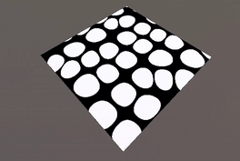
Figure 22: Cartoonish Worley noise obtained my rounding pixel brightness
  
The final result obtained by adding some more manipulations to the noise including:
- Different tint for each cells, by randomizing the color based on which cell the pixel belongs to.
- Cell border and cell core, by applying more clamping to the distance calculation.
- Overlaying texture, by displaying texture values instead of solid color.
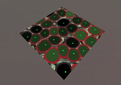
Figure 23: Example Voronoi shader applied to a plane, with background texture, randomized cell tint, cell border and core.
  
**Parameters**: 
- Motion Amplitude: Amplitude of the cell movement.
- Motion Frequency: Frequency of the cell movement.
- Cell Size: The size of the grid square of the cells (can be scaled in X-Y axis).
- Core Size: Size of the core.
- Border Width: Width of the cell border.
- Void Width: Width of the remaining space between the cells.
- Cell Color: Color of the cell.
- Border Color: Color of the cell border.
- Void Color: Color of the space between the cells.
- Core Color: Color of the cell core.
- Distance Calculation metric: float value, 0-1 Euclidian Distance; 1-2 Manhattan Distance; 2-3 Minowski Distance.
- Void Texture Size: Texture of the background space to fill between the cells.
  
- **Uses**: The shader has unlimited uses, by changing around the parameters and placing the shader in different settings, we can use it to make many different things:
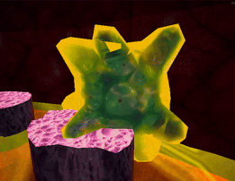
Figure 24: Worley noise inside a Fresnel shader, represneting moving cells inside an organism.
  
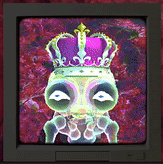
Figure 25: Centipede eyeballs made using Manhattan distance Worley noise with a rectangle grid. 
  
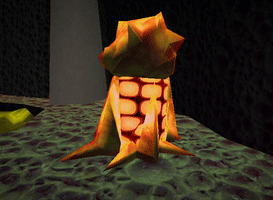
Figure 26: Moving fat cells made using Minkowski distance Worley noise with a bloody background texture.
  
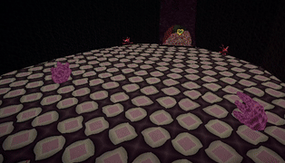
Figure 27: Organic checkerboard pattern made using Manhattan distance Worley noise, bringing the retro checkerboard texture to life.

### Particle System: Player's Special Effects
**Demo Scene**: 'Assets/Scenes/Report Demo/Particle System Demo.unity'

The player's particle system can be divided into three parts:
- **Digging Particles**: To create a convincing digging effect, mesh particles with gravity were used to represented digged up debris. The smoke effect is created by emitting particles with a transparent cloud texture that fades over time.
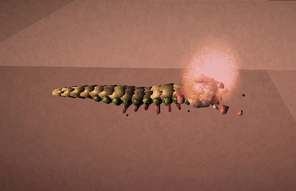
Figure 28: Debris and smoke particles emitting when digging down
  
- **Attacking Particles**: When the player attacks, the centipede plunges into the air. A fast moving particle system is implemented to enhance the attacking experience, making the player feel like the centipede is moving faster. Particles emitting and orbitting around the player's z axis is used to create a tornado effect around the centipede.
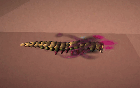
Figure 29: Wind particles around the centipede with the player attacks
  
- **Hit Particles**: When the centipede hits an enemy with it's head, a hit particle system is played. This particle system consists of animated blood sprites, blood particles rendered in streched billboard to represent blood drops and well as debris and smoke. 
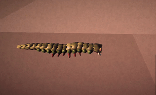
Figure 30: Blood and debris particles when the centipede hits an enemy
  
- **Final result**: The particle systems are then played on correct events and stops when the player finishes that action.

Figure 31: Combination of all effects with animation to create a smooth player special effects system

# Summary of Contributions
### Gameplay Programming
- Gameplay programming was handled by Ethan and Alex. Ethan worked on level 1 and the final boss, assisting with some components of the intro sequence, whilst Alex focussed on level 2 and enemy development. Gameplay programming covered all level elements, player elements, bosses, and enemies. Ethan focussed on player programming primarily.
### Sound
- Sound was primarily handled by Ella, both in terms of implementation and design. Ella acquired and implemented all sound effects into the code. Ethan assisted by acquiring two of the music tracks - for boss battles and arenas.
### Graphics
- Graphics programming was handled by Hoang. He did all the shaders, and the particle effects, as well as the UI elements. Other work included the death effect.
### scenes
- Intro cutscenes were handled by Ella, including the story, tutorial, and fly in cutscene. 
- Ella also handled the death screen and the win screen.
- The title screen was developed by Hoang.
- Ethan developed the first level and final boss level
- Alex developed the second level
### Asset collection
- Asset collection was predominantly handled by Ella and Hoang. They both curated models and textures for use in the game, which were implemented by Alex and Ethan in gameplay.
### Organization
- Hoang developed the file structure for game, which was immensely helpful in keeping our development process organized
- Ethan worked on the DevOps side of things, managing the main branch and dealing with merge conflicts. Ethan also managed the Trello for organizing tasks, and meeting setup.
### Other tasks
- Ella did our evaluation plan and led the writing of the final report.
- Ethan was responsible for the creation of our video trailer and part of the final report writing
- Ethan & Ella both worked on keeping the GDD up to date with recent changes.

# Bonus sections

## Sound Design
We carefully considered our sound design, as we found it an important component in eeriness conceptually. We used gross crawling sounds for movement and digging, that sound visceral and squishy. The unsettling ambiance was also important in adding to this feeling. We still included some tracks that were more powerful however, as players felt the constant unsettling ambiance didn’t fit certain sequences, and we included areas in which you battle enemies, which didn’t really make sense to have the eerie ambiance. We don’t think these moments violate the overall eeriness of the game, however. 

## Gameplay Programming
This section will cover a discussion of our gameplay programming process, as the learning involved makes it worth highlighting in this report.
 
### Reflection on development principles
In the initial stages of the project, object oriented design was not being well followed. There were many classes that had far too many responsibilities, which made debugging difficult and the purpose of game objects difficult to understand. On the start of project 2, one of the first steps was factoring components of the player functionality into distinct purposeful classes, which act as component in the unity engine to act appropriately. Indeed, this still isn't great object oriented design, as these classes are not components of a broader player class, but to the unity engine, that would be functionally the same, and would break the ability to interact with manually configured variables.
 
Enemies and Bosses were given abstract classes that created default and expected behaviours for these types of objects. Interfaces weren't added, as the concept of enemies and bosses in the game can have enough variation that the additional boilerplate contract of maybe 1 or 2 methods seemed pointless. Unity engine C# code doesn't adhere to many object oriented principles, so attempting to enforce them here wasn't especially helpful.
 
On reflection, the manual coding of things like bullet patterns in our game could have been streamlined into a particle effect system or something, as the writing of complex vector3 changes over time was time consuming as opposed to the use of animations or particle effects which allow for the same, without the overhead and inability to see what you're actually doing until you build. Since the gameplay designers Alex and Ethan come from a programming background, the first instinct was to implement bullet patterns and such in this way, but it may have been a better idea to take advantage of the low-code systems Unity provides as to not create complex code that is difficult to read and trace.
 
Lots of our scripts have serializable variables, which results in a lot of config between scenes and makes debugging difficult. We encountered lots of issues with variables not being set properly, or pointing at the wrong thing. In some ways within unity, this is inevitable, but we should have strived to bind variable values more strongly, using tools such as getters within the unity engine.
 
Most of these reflections stem from a gradual understanding of how to best use the unity engine to create extensible, well thought out games. We didn’t quite make or code base as refined as possible, but we got to a decent place with our code structure.
 
### Things we did well in programming
In general, script structure was quite good. We used helper functions where possible, but it might have been better to create a helper function namespace in a separate folder.
 
Our bosses made use of the animation timeline to trigger attacks like a state machine. This made it  really easy to visualise boss behaviour, and meant we only had to program the attacks the boss would use, rather than a complex behaviour system. For us, this represented a good compromise between what unity does well, and our coding experience.
 
We learnt a lot about C# and working with a framework like UnityEngine while coding, and we ended up writing managers to optimise the game. Unity is great for doing these kind of tasks easily, and we appreciated how even with our gradual learning of unity engine (and writing good code for it), it was easy to optimise our game.
 
 
### Reflection on the Unity engine
The key problem we had is how much the Unity Engine abstracts behaviour outside of what the code does. Variables are set outside the code when serializable, and GameObjects can just get the code of any other GameObject, creating high dependencies between other objects and not adhering to good OOP. For example, if a new programmer comes onto our project, the highly abstracted boss state machine and how it interfaces with code will be harder to understand than raw code, even if it's more efficient / easy to develop with once learnt.
 
Unity represents good learning for 3d development, but as programmers, we take some issue with its structure.

# References and External Resources
## References
- Brooke, J. (1996). SUS: A “quick and dirty” usability scale. Usability Evaluation In Industry, 207–212. [doi 10.1201 9781498710411 35](https://doi.org/10.1201/9781498710411-35).
- Worley, S. (1996). A cellular texture basis function, 291-294. [doi 10.1145 237170.237267](https://dl.acm.org/doi/10.1145/237170.237267).
- Quilez, I. (2013). Smooth minimum. (https://iquilezles.org/articles/smin/).

### Models:
  - **Crown in Victory Screen**:
  Dadaev. Crown 3D Model. Free3D, November 20th, 2019, [free3d.com/3d-model/crown](https://free3d.com/3d-model/crown-10070.html).
  - **Brain Final boss Model**
    Picturesque Games. (2021, November 17). Lowpoly Alien Buildings. @UnityAssetStore; Unity Asset Store. https://assetstore.unity.com/packages/3d/environments/lowpoly-alien-buildings-203675
  - **Spike Ball Model**
    YounGen Tech. (2011, Match 22), Ball Pack @UnityAssetStore; Unity Asset Store. https://assetstore.unity.com/packages/3d/props/ball-pack-446
### Sound FX:
  - **Player Attack Sound**:
  Damnsatinist.  (November, 2019). Retro Punch [attack.ogg]. Freesound. [freesound.org/people/damnsatinist/sounds/493915/](https://freesound.org/people/damnsatinist/sounds/493915/).
### Music
  - **Arena music**:
  Everson, S. (2010, June 13). Throwdown, Homestuck Vol 5 [Music].
  - **Boss music**
  I’m Gonna Teach You a Freakin’ Lesson! - Ribby: The Game (SPC700). (2024, July 19). [Music]. https://soundcloud.com/nununoisy/im-gonna-teach-you-a-freakin-lesson-ribby-the-game-spc700

## External Resources
[Our Survey Monkey questionnaire](https://www.surveymonkey.com/r/KK7ZBCY).
